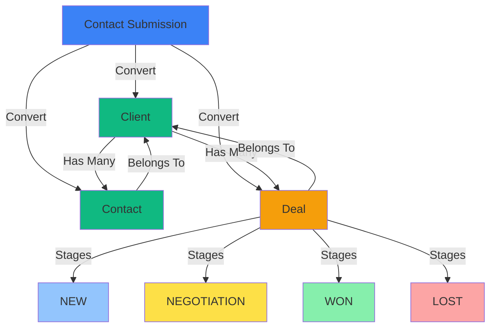

# CRM Flow: From Contact Submissions to Project Dealing

This document provides a comprehensive overview of the CRM system's lead-to-deal conversion pipeline.

---

## 📋 Stage 1: Contact Submission

### Entry Point
Public contact form on the website

### Data Captured
- **Contact details**: `fullName`, `email`, `phone`
- **Company information**: `company` (optional)
- **Project details**: `projectType`, `budgetRange`, `estimatedTimeline`, `description`
- **Metadata**: `submittedAt`, `isSpam` flag

### Status Lifecycle
```
NEW → REVIEWED → CONTACTED → CLOSED
```

### Implementation
- **Page**: [/crm/submissions](file:///c:/application/kopcus-digital/kopcus-dashboard/app/(dashboard)/crm/submissions/page.tsx)
- **Component**: [SubmissionTable.tsx](file:///c:/application/kopcus-digital/kopcus-dashboard/components/crm/SubmissionTable.tsx)
- **API Endpoint**: `GET /crm/submissions`

---

## 🔄 Stage 2: Conversion Process

### Trigger
User clicks "Convert to Deal" from the submissions table

### Conversion Flow

#### 1. Dialog Opens
[ConvertToDealDialog.tsx](file:///c:/application/kopcus-digital/kopcus-dashboard/components/crm/ConvertToDealDialog.tsx) presents a form with:
- **Client Name**: Pre-filled from `submission.company` or `submission.fullName`
- **Deal Title**: Auto-suggested as `"{projectType} Project for {company/name}"`
- **Budget Hint**: Displays the budget range from submission
- **Deal Value**: User enters estimated deal value in IDR

#### 2. API Call
```typescript
POST /crm/submissions/{id}/convert

Payload:
{
  clientName: string,
  dealTitle: string,
  dealValue: number
}
```

#### 3. Backend Creates Three Entities Atomically
- **Client**: New company/individual record
- **Contact**: Person who submitted the form (linked to client)
- **Deal**: Sales opportunity (linked to client, starts at "NEW" stage)

#### 4. State Updates
[use-crm-store.ts](file:///c:/application/kopcus-digital/kopcus-dashboard/hooks/use-crm-store.ts) updates:
- Submission status → `CLOSED`
- New client added to `clients` array
- New deal nested under client's `deals` array

---

## 💼 Stage 3: Deal Management

### Pipeline View
- **Page**: [/crm/pipeline](file:///c:/application/kopcus-digital/kopcus-dashboard/app/(dashboard)/crm/pipeline/page.tsx)
- **Component**: [KanbanBoard.tsx](file:///c:/application/kopcus-digital/kopcus-dashboard/components/crm/KanbanBoard.tsx)

### Deal Stages
```
NEW → NEGOTIATION → WON / LOST
```

### Deal Properties
```typescript
{
  id: string,
  clientId: string,
  title: string,
  description?: string | null,
  value: number,
  stage: 'NEW' | 'NEGOTIATION' | 'WON' | 'LOST',
  createdAt: string,
  updatedAt: string
}
```

### Available Actions
- **Update Deal**: Change title, description, value, or stage
  - API: `PATCH /crm/deals/{id}`
- **Delete Deal**: Remove from pipeline
  - API: `DELETE /crm/deals/{id}`
- **Create Deal**: Add new deal for existing client
  - API: `POST /crm/deals`

---

## 👥 Stage 4: Client & Contact Management

### Client View
- **Page**: [/crm/clients](file:///c:/application/kopcus-digital/kopcus-dashboard/app/(dashboard)/crm/clients/page.tsx)
- **API Endpoints**: 
  - `GET /crm/clients` - List all clients
  - `GET /crm/clients/{id}` - Get client details
  - `DELETE /crm/clients/{id}` - Delete client (cascades)

### Data Structure
```typescript
Client {
  id: string,
  name: string,
  createdAt: string,
  contacts: Contact[],  // People associated with this company
  deals: Deal[]         // All sales opportunities
}

Contact {
  id: string,
  clientId: string,
  name: string,
  email: string,
  phone?: string | null,
  position?: string | null
}
```

### Capabilities
- View all clients with their contacts and deals
- Create additional deals for existing clients
- Add more contacts to a client
- Delete clients (cascades to contacts and deals)

---

## 🔗 Data Relationships



---

## 🗄️ State Management

### Zustand Store
[use-crm-store.ts](file:///c:/application/kopcus-digital/kopcus-dashboard/hooks/use-crm-store.ts)

```typescript
interface CrmStoreState {
  // State
  submissions: ContactSubmission[],
  clients: ClientWithRelations[],  // Includes nested contacts & deals
  isLoading: boolean,
  isConverting: boolean,
  isMutating: boolean,
  
  // Actions
  loadSubmissions: () => Promise<void>,
  loadClients: () => Promise<void>,
  convertSubmission: (id: string, payload: ConvertPayload) => Promise<void>,
  createDeal: (payload: CreateDealPayload) => Promise<void>,
  updateDeal: (id: string, updates: Partial<Deal>) => Promise<void>,
  deleteDeal: (id: string) => Promise<void>,
  deleteClient: (id: string) => Promise<void>,
  
  // Selectors
  getClientById: (id: string) => ClientWithRelations | undefined,
  getDealsByStage: (stage: DealStage) => Deal[],
  getActiveDeals: () => Deal[]
}
```

### Key Features
- **Optimistic UI updates**: Immediate feedback before API confirmation
- **Toast notifications**: User feedback for all actions
- **Error handling**: Graceful degradation with error messages
- **Defensive programming**: Array checks to prevent crashes
- **Nested data structure**: Efficient querying with denormalized data

---

## 📊 Complete User Journey Example

### Scenario: Website Redesign Project

1. **Customer submits contact form**
   - Creates `ContactSubmission` with status `NEW`
   - Data: John Doe, john@acme.com, Acme Corp, Website Redesign, $5k-$10k budget

2. **Admin reviews in `/crm/submissions`**
   - Views submission details
   - Updates status to `REVIEWED`

3. **Admin clicks "Convert to Deal"**
   - Opens `ConvertToDealDialog`
   - Pre-filled: Client Name = "Acme Corp", Deal Title = "Website Redesign Project for Acme Corp"

4. **Admin fills deal details**
   - Sets deal value: $10,000
   - Submits conversion

5. **System creates three entities:**
   - **Client**: "Acme Corp" (id: client-123)
   - **Contact**: "John Doe" (john@acme.com, linked to client-123)
   - **Deal**: "Website Redesign Project for Acme Corp" ($10,000, stage: NEW, linked to client-123)

6. **Submission status updated**
   - Status changes to `CLOSED`

7. **Deal appears in `/crm/pipeline`**
   - Visible under "New" column in Kanban board

8. **Admin progresses deal through stages**
   - NEW → NEGOTIATION (after initial call)
   - NEGOTIATION → WON (after contract signed)

9. **Admin can view client details in `/crm/clients`**
   - See all contacts and deals for Acme Corp
   - Add more deals or contacts as needed

---

## 🔑 Key Design Decisions

### 1. One-Click Conversion
Single action creates all three entities (client, contact, deal) to minimize friction and ensure data consistency.

### 2. Nested Data Structure
Clients contain their contacts and deals for efficient querying and reduced API calls. Trade-off: More complex state updates.

### 3. Separate Status Lifecycles
- **Submissions**: NEW → REVIEWED → CONTACTED → CLOSED
- **Deals**: NEW → NEGOTIATION → WON / LOST

This separation allows tracking submission handling independently from deal progression.

### 4. Spam Protection
Submissions include `isSpam` flag for filtering, with visual indicators (red background) in the UI.

### 5. Responsive Design
- **Submissions**: Mobile card view + desktop table view
- **Pipeline**: Horizontal scroll Kanban with snap points for mobile/tablet

### 6. Type Safety
Shared TypeScript interfaces between [lib/types/crm.ts](file:///c:/application/kopcus-digital/kopcus-dashboard/lib/types/crm.ts) and [lib/api/crm.ts](file:///c:/application/kopcus-digital/kopcus-dashboard/lib/api/crm.ts) ensure consistency.

---

## 🛠️ Technical Stack

### Frontend
- **Framework**: Next.js 16 with App Router
- **State Management**: Zustand with devtools
- **UI Components**: Shadcn/ui (Radix UI primitives)
- **Forms**: React Hook Form + Zod validation
- **Styling**: Tailwind CSS
- **Notifications**: Sonner (toast library)

### API Layer
- **Client**: [lib/api/client.ts](file:///c:/application/kopcus-digital/kopcus-dashboard/lib/api/client.ts) - Authenticated API client
- **CRM API**: [lib/api/crm.ts](file:///c:/application/kopcus-digital/kopcus-dashboard/lib/api/crm.ts) - CRM-specific endpoints

### Backend Integration
All API calls go through the authenticated `apiClient` which handles:
- Authentication headers
- Error handling
- Response normalization
- Double-nested response unwrapping

---

## 📈 Future Enhancements

### Potential Improvements
1. **Drag-and-drop**: Move deals between stages via drag-and-drop
2. **Activity timeline**: Track all interactions with clients
3. **Email integration**: Send emails directly from CRM
4. **Deal templates**: Pre-configured deal structures for common project types
5. **Revenue forecasting**: Calculate projected revenue by stage
6. **Client notes**: Add internal notes to client records
7. **File attachments**: Attach contracts, proposals, etc.
8. **Bulk actions**: Convert multiple submissions at once
9. **Advanced filtering**: Filter by date range, budget, project type
10. **Export functionality**: Export data to CSV/Excel

---

## 📝 Related Documentation

- [Frontend CRM Integration](file:///c:/application/kopcus-digital/kopcus-dashboard/docs/FRONTEND_CRM_INTEGRATION.md)
- [CRM Internship Report](file:///c:/application/kopcus-digital/kopcus-dashboard/docs/CRM_INTERNSHIP_REPORT.md)
- [CRM LaTeX Section](file:///c:/application/kopcus-digital/kopcus-dashboard/docs/CRM_LATEX_SECTION.tex)

---

**Last Updated**: 2025-12-18  
**Version**: 1.0
